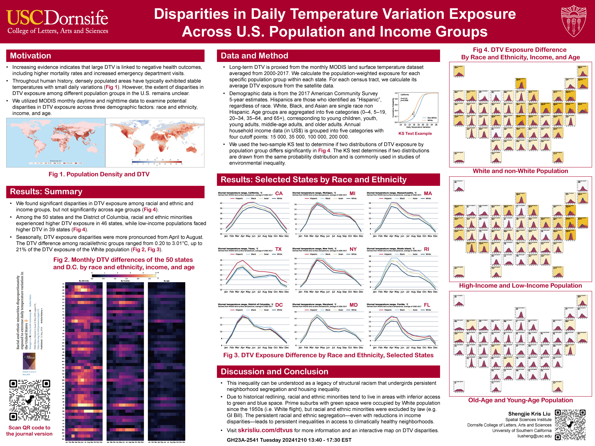

# AGU 2024

Disparities in Daily Temperature Variation Exposure Across U.S. Population and Income Groups

Check out the poster presentation at AGU 2024, Tuesday afternoon: GH23A-2541 Tuesday 20241210 13:40 - 17:30 EST

**Shengjie Liu** personal homepage: [skrisliu.com](https://skrisliu.com)

Journal version published in PNAS Nexus: [https://doi.org/10.1093/pnasnexus/pgae176](https://doi.org/10.1093/pnasnexus/pgae176)

Want to know the DTV exposure by race and ethnicity in all 50 states? Go to this interactive map: [https://skrisliu.com/dtvus/map.html](https://skrisliu.com/dtvus/map.html)

This research has been featured in multiple media outlets, including the [United Nations PreventionWeb](https://www.preventionweb.net/news/heat-risk-isnt-just-about-highs-large-daily-temperature-swings-can-harm-human-health-maps-show).

# Racial and Ethnic Minorities Disproportionately Exposed to Extreme Daily Temperature Variation in the United States

[Shengjie Liu](https://skrisliu.com) (University of Southern California), [Emily Smith-Greenaway](http://emilysmithgreenaway.org/) (University of Southern California)

This is a GitHub repo at [https://github.com/skrisliu/dtvus](https://github.com/skrisliu/dtvus)

## Obtain Public Data
    U.S. Census Tract Shapefile
    Long-term MODIS LST day-time and night-time temperatures, sd and differences at 1 km based on the 2000–2017 time series
    ACS Table DP05 (race and ethnicity, age), census tract level
    ACS Table S1901 (income), census tract level
    ACS Table DP04 (rent), census tract level
	
After downloading the ACS table, please delete the 2nd row "description" and save them as the "clean" version used in the code. We prepared the exposure table ("dfmtable.pkl") here for the ease of use. 

## Python Package Version
    numpy==1.24.3
    matplotlib==3.7.2
    pandas==2.0.3
    seaborn==0.12.2

## Zonal Statistics as Table

Zonal statistics of the LST data, each month each year, to census tracts. This is the base data for anlaysis. We did this analysis on ArcGIS (paid software), but with some techniques, it should be able to do the job with QGIS (open source) or in Python. 
    

## Figure 1

### Population Density

The world’s annual mean daily temperature variation data in Fig. 1 is from the WorldClim v2 dataset 1970-2000, publicly available on [their website](https://www.worldclim.com/version2). 

### Daily Temperature Variations

The population density data is from the NASA Center for International Earth Science Information Network at Columbia University. We use the gridded population of the world v4 in 2000-2020 ([https://sedac.ciesin.columbia.edu/data/collection/gpw-v4](https://sedac.ciesin.columbia.edu/data/collection/gpw-v4)).

## Figure 2

### Run the following scripts in order

#### 1. Generate population-weighted exposure data of each state by race and ethnicity, save the data in folder
    python makefig2_1.py

#### 2. Load the population-weighted exposure data, merge as White and non-White, then run kernel density estimation, save KDE in folder
    python makefig2_2.py

#### 3. Calculate K-S statistics
    python makefig2_3.py

#### 4. Load the kernel density estimation of White and non-White populations from (2), load the statistics from (3), make Figure 2
    python makefig2_4.py

## Figure 3

### Monthly DTV difference of 51 states, by race and ethnicity, income, and age
    python HeatMap.py
